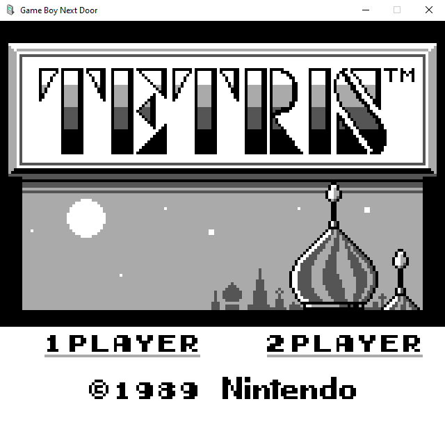

# Projeto Game Boy Next Door
## FPRO/MIEIC, 2020/21
## Miguel Faria Curval (up201105191)
## 1MIEIC08

### Objetivo

1. Criar um emulador de Game Boy.
2. Conseguir que o JCL jogue Pokemon no meu emulador. (Tetris também não era mau.) **JCL**: é melhor apontar para o Tetris, para não ser demasiado ambicioso.

### Descrição

É um emulador de Game Boy.

### UI

### Pacotes

- Pygame

### Tarefas

1. [ ] Reimplementar o PPU, ou pelo menos fazer fix a timings e interrupts do PPU.
2. [ ] Lidar com o dread existencial de não ter tempo para implementar precisão ao nível do ciclo da máquina.
