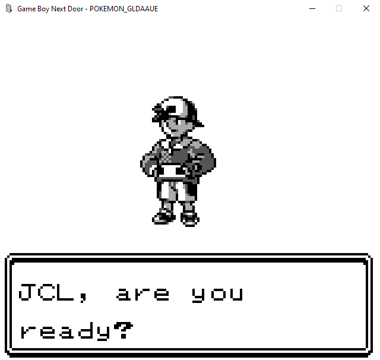
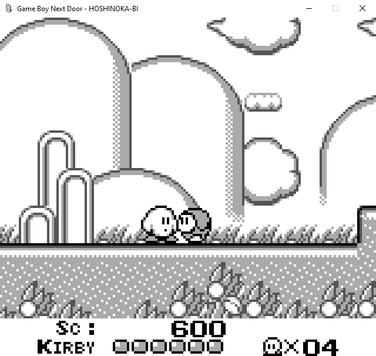
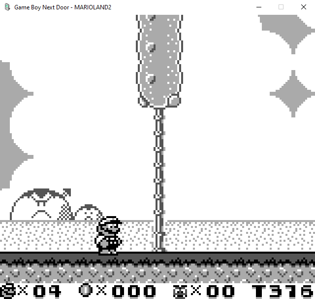
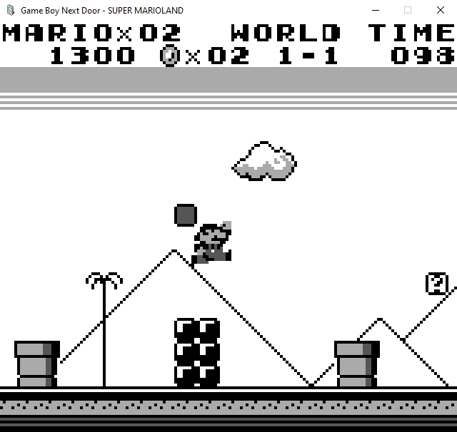
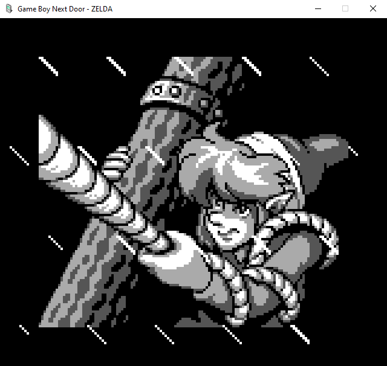
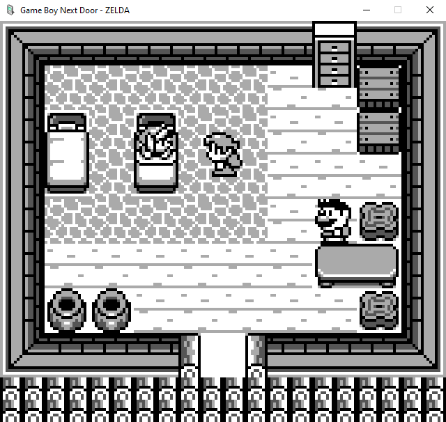
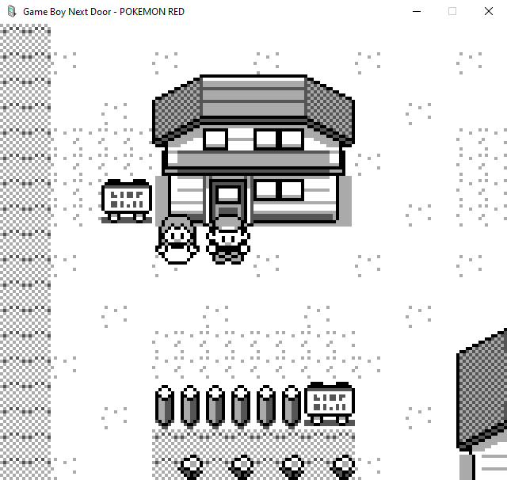
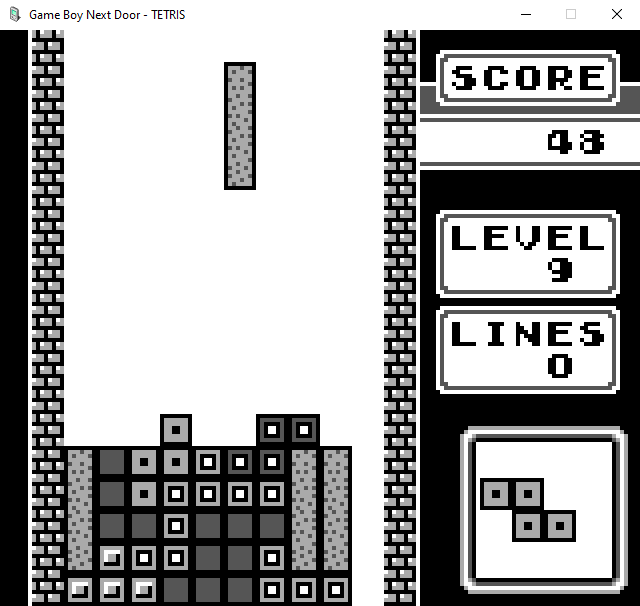
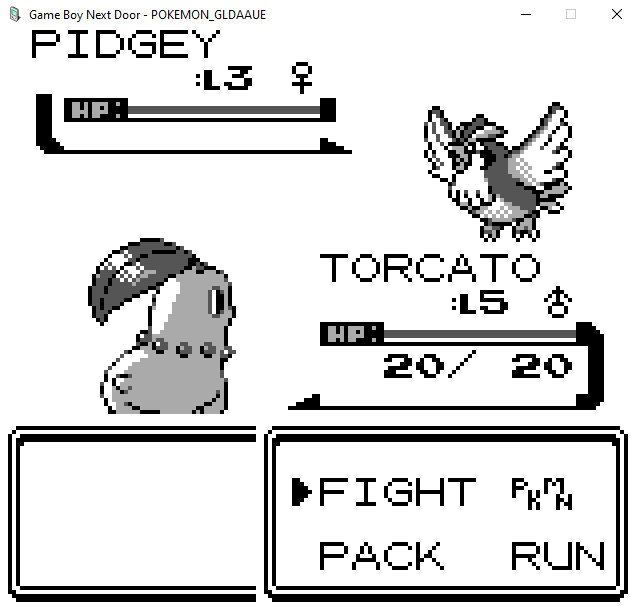
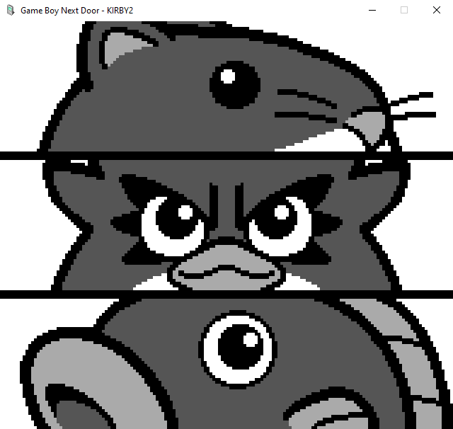

# Projeto Game Boy Next Door
## FPRO/MIEIC, 2020/21
## Miguel Faria Curval (up201105191)
## 1MIEIC08

### Objetivo

1. Criar um emulador de Game Boy.
2. Conseguir que o JCL jogue Pokemon no meu emulador. (Tetris também não era mau.) **JCL**: é melhor apontar para o Tetris, para não ser demasiado ambicioso.
3. Mostrar que com boa optimização e conhecimento de algoritmos qualquer linguagem pode ter excelente performance, mesmo em aplicações que requerem alto nível de desempenho. Não usar C inline, Cython, etc. Tudo em python simples.

### Descrição

O emulador está dividido em partes que tentam seguir as unidades lógicas do próprio Game Boy.
CPU comunica com a Memory Mapping Unit, memória comunica com a Pixel Processing Unit, Audio Processing Unit, Timer, e Joypad. A main comunica com o módulo Gameboy, que unifica todos os componentes e abstrai para tarefas que seriam lógicas num GB, como por exemplo correr uma frame. De momento tudo o resto é feito na main.

IMPORTANTE: Para já é NECESSÁRIO PyPy para conseguir ter frames por segundo em vez de segundos por frame.

### UI

### Controlos

- **Setas**: <kbd>&uarr;</kbd> <kbd>&darr;</kbd> <kbd>&larr;</kbd> <kbd>&rarr;</kbd>
- **A**: <kbd>X</kbd>
- **B**: <kbd>Z</kbd>
- **Start**: <kbd>Enter</kbd>
- **Select**: <kbd>Backspace</kbd>

### Pacotes

- Pygame

### Tarefas

1. [x] Reimplementar o PPU. (A ideia era corrigir os timings e interrupts, acabei por fazer de novo, desta vez com precisão a nível do ciclo.)
2. [x] Tile cache, só isto fez o emulador correr 4 vezes mais rápido. Ao escrever na VRAM, o programa calcula a tile inteira e guarda no cache. Reparei que escrever na VRAM é ordens de magnitudo mais raro que ler a VRAM, e é impossível aceder à VRAM durante o Pixel Transfer (Modo 3 do PPU), logo não altera de todo a precisão, e faz uma diferença colossal para performance.
3. [x] Lidar com o dread existencial de não ter tempo para implementar precisão ao nível do ciclo da máquina.
4. [x] Implementar precisão ao nível do ciclo da máquina no PPU e Timer.
5. [x] O Timer emula bugs e edge cases, não sei o que me deu na cabeça, isto deveria ter sido a última coisa a implementar.
6. [ ] Ganhar coragem para reimplementar o CPU e MMU from scratch, para que estejam tão precisos como o PPU e Timer. O emulador é NO MÁXIMO tão accurate como o CPU, não faz sentido ter o CPU como bottleneck de precisão já que o resto está tão direitinho.
7. [x] Joypad e controlos.
8. [x] Fazer decouple do Pygame e do PPU.
9. [x] Reimplementar o framebuffer para melhor eficiência. (Fiz magia, está MUITO eficiente mesmo.)
10. [x] Sprite rendering.
    1. [x] Em princípio o PPU já desenha os sprites da Object Attribute Memory, falta só ter sprites na OAM para desenhar em primeiro lugar.
    2. [x] Direct Memory Access. É raro sprites serem passados para a OAM manualmente, logo sem OAM DMA não há sprites.
11. [ ] Fully accurate sprite rendering.
    1. [ ] Limite de 10 sprites por linha.
    2. [ ] Efeitos mid-frame.
    3. [ ] Cycle-accurate DMA.
    4. [ ] Optimizar. O PPU está ridiculamente accurate, gasta 80% do processing power. Com sprites assim tão precisos vai ficar impossível de correr mesmo com PyPy. Pensar em ideias para algum tipo de cache eficiente, ou talvez até numa heurística (SEM SACRIFICAR PRECISÃO).
12. [ ] Implementar os Memory Bank Controllers (circuitos imbutidos em cada cartucho) mais comuns, MBC1 e MBC3 devem cobrir cerca de 60% dos jogos (citation needed, não me lembro onde vi essa estatística).
    1. [x] MBC1
    2. [x] MBC2
    3. [x] MBC3
        1. [x] Tudo menos RTC...
        2. [ ] Real Time Clock
    4. [x] MBC5 (Já agora... Só é usado por Game Boy Color que eu saiba, mas não custou implementar.)
13. [ ] Criar testes automatizados para os diferentes test roms.
    1. [ ] blargg
    2. [ ] mooneye-gb
14. [ ] Caçar bugs à volta da feature para saltar a bootstrap ROM. Alterei imensa coisa desde a implementação inicial, sem ir atualizando e testando os valores, deve estar imensamente broken.
15. [ ] Aldrabei um bocado no coupling, a main está de momento a comunicar diretamente com o joypad por exemplo, portanto há que fazer decouple.
16. [ ] As jump tables da MMU estão hacky, tudo o que é lido pela MMU tem de receber um argumento extra. Arranjar maneira de alterar isto sem sacrificar performance, acessos à memória são muito comuns.
17. [ ] LIMPAR O CÓDIGO, FAZ DOER OS OLHOS E OS NEURÓNIOS (Está praticamente encriptado, o Guido teria um ataque.)
18. [ ] Áudio e APU. (Não vou ter tempo para implementar áudio, talvez depois da deadline.)
19. [x] Saves.
